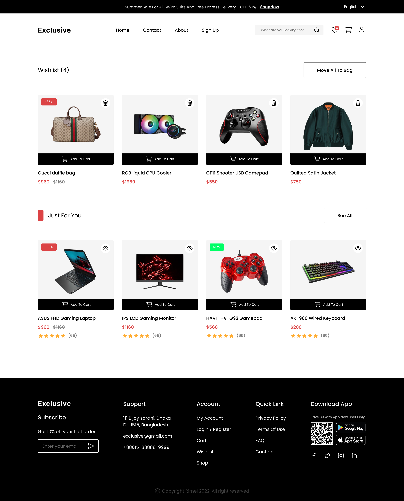
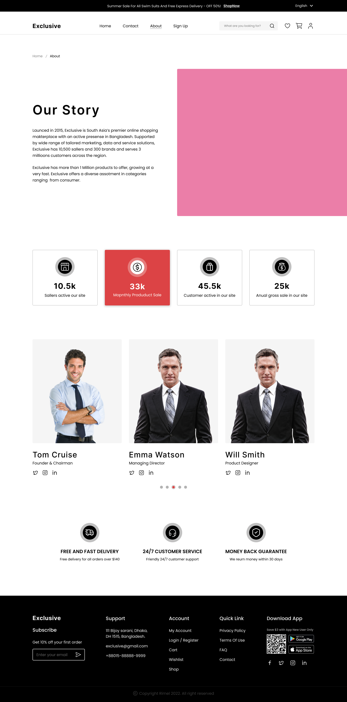
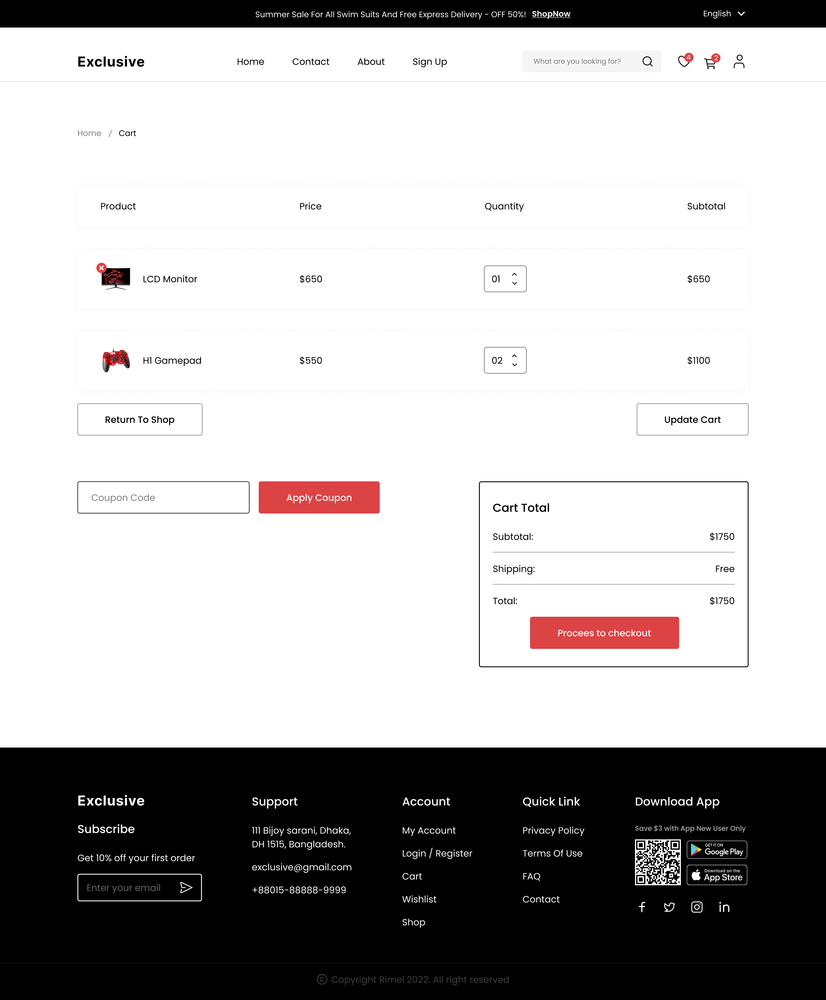
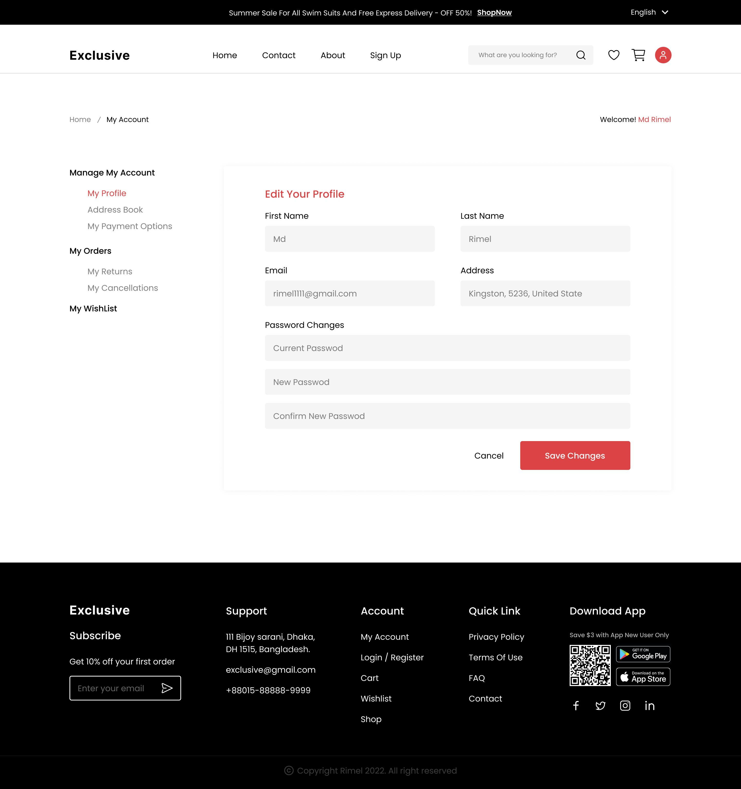

# E-Commerce

## [🌟Live Website🌟](https://e-commerce-website-nine-bice.vercel.app/)

##  [🌟Design on Figma 🌟](https://www.figma.com/file/yn2DFQJla0UiSMvomFsqwT/E-Commerce-Website-%D9%90Almdrasa?type=design&mode=design&t=fqPRRAQH5lDJGmoY-0)

  

## Table of Contents

- [Screenshots](#screenshots)
- [Features](#features)
- [Technologies Used](#technologies-used)
- [Contact](#contact)

## Screenshots
1. E-Commerce HomePage
  
2. Sign Up
  
3. Log In
  
4. Product Details page
  
5. Wishlist
  
6. About
  
7. Cart
  
8. CheckOut
  
9. Contact
  
10. Account
  

## Features

- **Search Bar**: Users can easily search for articles by keywords.
- **Responsive Design**: The application is fully responsive, ensuring optimal user experience across various devices.

## Technologies Used

- **React**: JavaScript library for building user interfaces.
- **Vite**: Fast, modern build tooling for frontend development.
- **Tailwind CSS**: Utility-first CSS framework for rapid UI development.
- **Material-UI**: React components for faster and easier web development.
- **Custom Hooks**: Utilized custom React hooks for managing state and logic efficiently.

## Contact

- [Author](https://github.com/MMansy19)
- [Website](https://mahmoud-mansy-portfolio.netlify.app/)
- [Email](mailto:mahmoud2abdalfattah@gmail.com)
- [LinkedIn](https://www.linkedin.com/in/mahmoud-mansy-a189a5232)
